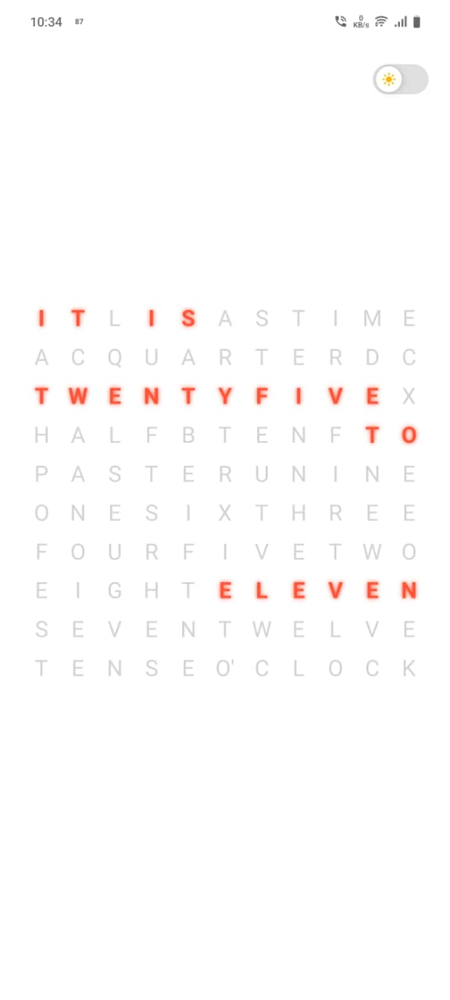
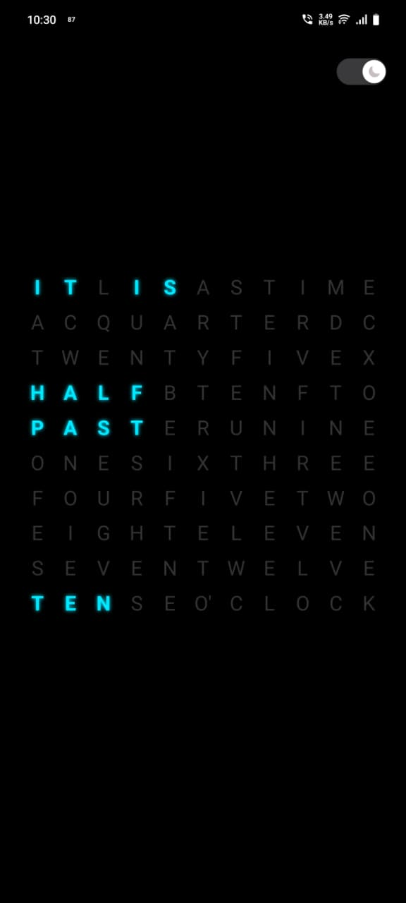

# Matrix Word Clock

A production-ready, typographic clock application built with **React Native** and **TypeScript**. This project transforms standard digital time into human-readable sentences (e.g., *"IT IS TEN PAST SIX"*) displayed on a custom animated 11x10 grid.

Beyond the visual interface, this repository demonstrates a complete **DevOps Lifecycle**:
* **Continuous Integration (CI):** Automated testing via GitHub Actions ensures code quality on every push.
* **Continuous Delivery (CD):** Automated builds via EAS deliver installable APKs immediately upon release.
* **Clean Architecture:** Scalable folder structure with strict typing and unit test coverage.

## Features

* **Fuzzy Time Logic:** Converts numeric time (10:18) into human phrases ("TWENTY PAST TEN").
* **Matrix Grid UI:** Custom 11x10 letter grid with dynamic highlighting logic.
* **Home Screen Widget:** Native Android widget that displays the word clock directly on the launcher.
* **Theme Engine:** Built-in Light/Dark mode with persistent user preference (AsyncStorage).
* **Smooth Animations:** Custom animated toggle switch with interpolated colors and icons.
* **Robust Testing:** Full Unit and Component test suite using Jest & React Native Testing Library.
* **Automated Pipelines:**
    * **CI:** Runs tests on every Pull Request to prevent regressions.
    * **CD:** Automatically builds an Android APK via EAS when code is pushed to `main`.

## 🛠 Tech Stack

* **Framework:** React Native (Expo SDK 52)
* **Language:** TypeScript
* **State Management:** React Context API
* **Persistence:** AsyncStorage
* **Native Widget:** `react-native-android-widget`
* **Testing:** Jest, React Native Testing Library
* **CI/CD:** GitHub Actions, EAS (Expo Application Services)

## Getting Started

Follow these instructions to run the project on your local machine.

### 1. Installation
Clone the repository and install the necessary dependencies.

```bash
git clone [https://github.com/joel-jain/WordClock-react-native.git](https://github.com/joel-jain/WordClock-react-native.git)
cd WordClock-react-native
npm install
```

### 2. Running the App

Start the Expo development server. You can scan the QR code with the **Expo Go** app on Android/iOS.

```bash
npx expo start
```

*(Tip: Use `npx expo start --clear` if you encounter cache issues).*

### 3. Running Tests

Execute the Unit and Component test suite to verify logic integrity.

```bash
npm test
```

## Building for Production

This project uses **EAS Build** to generate installable Android APKs.

**Prerequisites:**
* An [Expo Account](https://expo.dev/signup)
* EAS CLI installed globally (`npm install -g eas-cli`)

**Build Command:**
Run the following command to trigger a cloud build for a standalone APK (using the custom production profile):

```bash
eas build --platform android --profile production-apk

##  Project Structure

```
.github/             # CI/CD Workflows (ci.yml, cd.yml)
src/
├── components/      # Reusable UI (Grid, WordCell, ThemeToggle)
├── context/         # Theme State & Persistence Logic
├── hooks/           # Custom Hooks (useTime, useTheme)
├── screens/         # Main Screen Layouts (HomeScreen)
├── theme/           # Color Palettes
├── utils/           # Time Logic & Grid Mapping Data
└── __tests__/       # Unit & Component Tests
```

##  Quick Command Reference

## Quick Command Reference

| Command | Description |
| :--- | :--- |
| `npm install` | Installs all dependencies listed in package.json |
| `npx expo start` | Starts the local development server |
| `npm test` | Runs the full Jest test suite |
| `eas build -p android --profile production-apk` | Builds a release-ready Android APK |
| `npx expo install [package]` | Installs a new library compatible with Expo |

## Future Roadmap

We have exciting plans to scale this project beyond an MVP. Here is what's coming next:

* [ ] **Custom Themes:** Implement a theme selector with new palettes (e.g., *Matrix Green*, *Cyberpunk Neon*, *Dracula*).
* [ ] **Multi-Language Support (i18n):** Adapt the core logic to support Spanish, German, and French time phrasing.
* [ ] **WearOS / WatchOS Support:** Extend the codebase to run as a standalone smartwatch app.

##  Screenshots

| Light Mode | Dark Mode |
|:---:|:---:|
|  |  |

```
        Red Glow                        .        Cyan Glow
```
